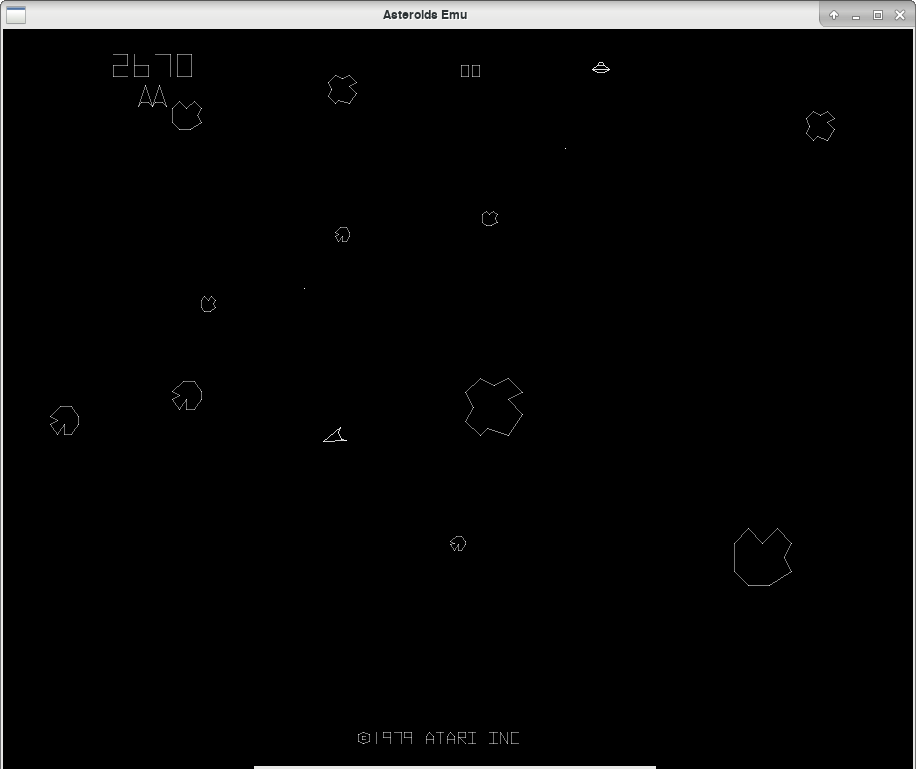

# Asteroids-Emu

Emulator to run Asteroids game ROM.

If you just want to play retro games, probably what you really want is
[MAME](https://www.mamedev.org/). This project is a bit of fun and a challenge
to see if I can create a working emulator.

To build the emulator a [Rust](https://www.rust-lang.org) development
environment is required. The Cargo tool will take care of downloading and
compiling the required Rust libraries. Also required to build the game are
SDL2 libraries. For the Arch Linux distribution the required packages are
sdl2 and sdl2_gfx. For other platforms these may be grouped differently and
separate dev packages may also be required.

When run, the emulator expects to find the file named `asteroids.rom` in
subdirectory `assets`. This file should be 8192 bytes with the first 2048 bytes
being the DVG video ROM and the remaining 6144 bytes being the game ROM. The
emulator has been tested with revision 2 of the game ROM. The ROM file is not
provided here but it should not be too difficult to find. I have come across
some ROM images that are split into 2k chunks, which may need a bit of trial and
error to join together in the right order.

Full disassemblies for the revision 2 ROMs are published here:
http://www.computerarcheology.com/Arcade/Asteroids/

The game controls are as follows:
* S: Start game
* Z: rotate anti-clockwise
* X: rotate clockwise
* Right shift: fire
* /: Thrust
* Space: Hyperspace

Creating an emulator for Asteroids has fortunately been made a lot easier
thanks to the work that others have done in explaining the hardware used and
how it is programmed. The Computer Archeology link above is incredibly useful
as is Philip Pemberton's excellent write up on the display processor:
[Hitch-Hacker’s Guide to the Atari Digital Vector Generator](https://www.philpem.me.uk/elec/vecgen.pdf).
Also, [this](http://www.obelisk.me.uk/6502/) site was very useful to
remind me of all those things about the 6502 CPU that I had forgotten.
